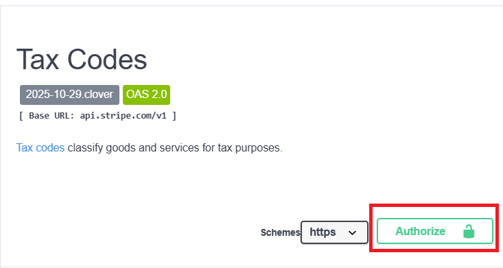
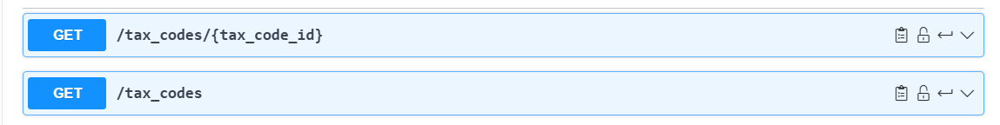
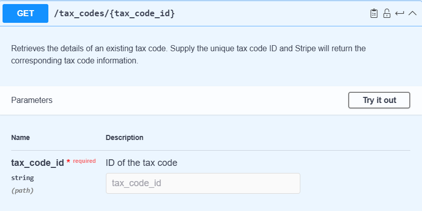
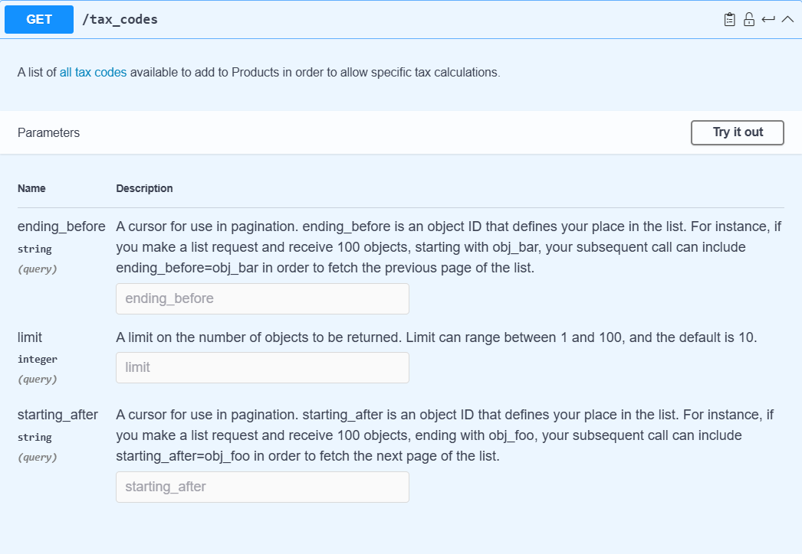
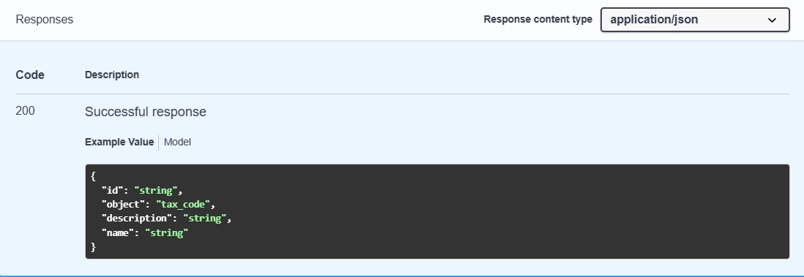
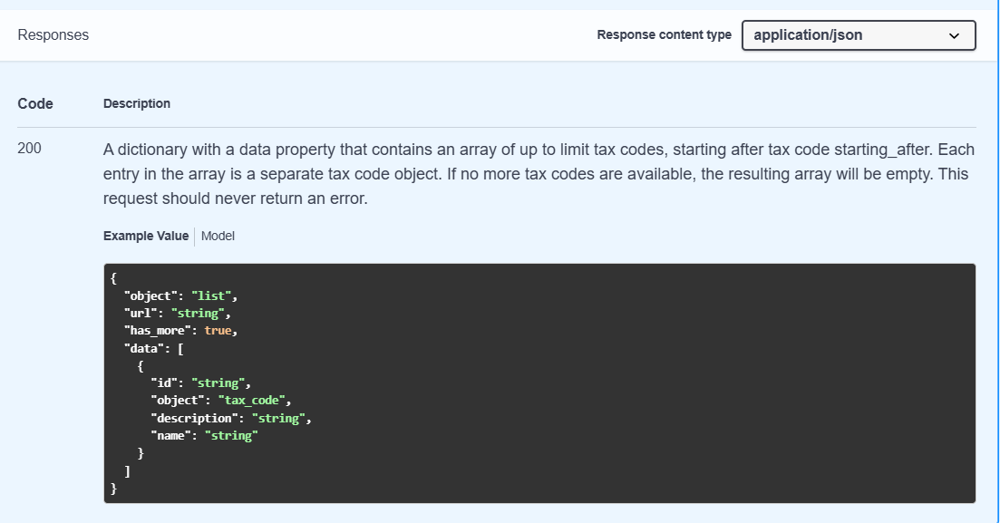

# Stripe Tax Code API Requests
*[Technical Writing Portfolio](https://lmspann.github.io/)*

## About
Stripe is a company that has an API for credit card transactions. Many online companies use it as a way 
to charge their customers. Customers will enter credit card information at a company’s website, 
then the company’s servers will make calls to the Stripe API to make those transactions happen. 

[Tax codes](https://docs.stripe.com/tax/tax-codes) classify goods and services for tax purposes. Stripe's Tax Code API requests are used 
to obtain codes that determine a product’s tax rate.

I referenced [Stripe's API documentation](https://docs.stripe.com/api/tax_codes?lang=curl)
to create a sample OAS for the Tax Code API endpoints in 
[Swagger](https://app.swaggerhub.com/apis/techwritingportfolio-d6c/Stripe-API-V1/2025-10-29.clover).

## Access and Authentication
Accessing the Tax Code API endpoints require a Stripe user account with basic authorization credentials. 
Anyone can create a Stripe user account by signing up at [Stripe.com](https://stripe.com/). 

In my sample OAS, clicking the "Authorize" button will open a dialogue box to enter a user name and password. 

 
## Requests
There are two tax code endpoints which use the `GET` method to list all tax codes and retrive tax codes.

The `GET` requests in my sample OAS are depicted in the screenshot below.

### Parameters
The `tax_code_id` is the only required paramter for the `/tax_codes/{tax_code_id}` request. 

The `ending_before`, `limit`, and `starting_after` parameters apply to the `/tax_codes` request. These parameters are not required. 
When left unpopulated, the default number of Tax Codes retrieved is ten.

## Responses
The Stripe API returns JSON responses. 

### `/tax_codes/{tax_code_id}` Request Response Code

### `/tax_codes` Request Response Code

